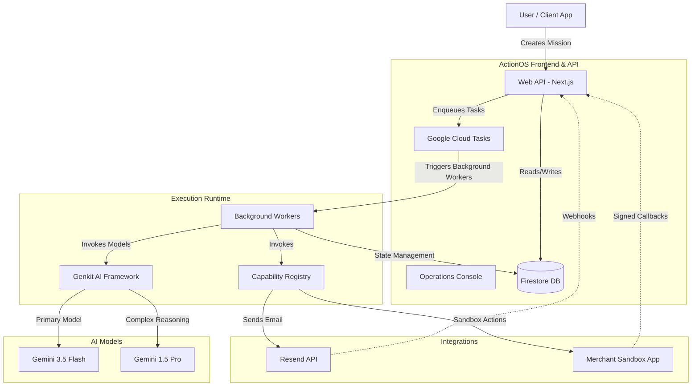

# ActionOS Architecture

ActionOS is a robust, production-ready framework for executing autonomous objectives. It transforms natural language instructions into verifiable tasks, executing them securely and asynchronously over resilient infrastructure. This document outlines the architecture, data models, integration points, and Google Cloud deployment strategy for ActionOS.

## Core Concepts

*   **Mission:** A user-defined objective representing a high-level goal (formerly "Case").
*   **Agent Framework (Genkit):** ActionOS uses Google's Genkit to orchestrate the intelligence layer, specifically using Gemini 1.5 Pro and Gemini 3.5 Flash models for planning, extraction, and evaluation.
*   **Capabilities:** Discrete, isolated actions that the agent can execute (e.g., sending an email, interacting with a merchant sandbox). Capabilities are secured through a strict authorization and idempotency boundary.
*   **Execution Runtime:** An asynchronous event loop powered by Google Cloud Tasks that manages the lifecycle, retries, and progression of Missions.

## High-Level Architecture

## System Components

### 1. Web API & Console (`@actionos/web`)
The primary interface for users to monitor, manage, and create missions. Built on Next.js, it acts as the gateway for both synchronous API interactions and the frontend user experience.
*   **Operations Console:** Provides a Live Mission Console showing execution timelines, active capabilities, and system health.
*   **Controllers:** Route handlers translate HTTP requests into domain commands and dispatch them to the Execution Runtime.

### 2. Execution Runtime (`@actionos/runtime`)
The heart of ActionOS. When a Mission is created, it is pushed to the Execution Runtime which evaluates its state and determines the next step.
*   **Asynchronous Processing:** Long-running LLM calls and third-party integrations are processed asynchronously via Google Cloud Tasks to ensure the API remains responsive.
*   **Idempotency & Resiliency:** Every capability execution and state transition is idempotent. The runtime can recover from transient failures, timeouts, and interrupted actions.

### 3. Agent & Genkit Flows (`@actionos/genkit-flows`)
Handles all interaction with the Gemini models.
*   **Goal Decomposition:** The agent breaks down the Mission into actionable steps (the Execution Plan).
*   **Action Selection:** Determines which capability to invoke based on the current context.
*   **Outcome Verification:** Evaluates the result of a capability invocation to verify if the goal was successfully achieved.

### 4. Persistence Layer (`@actionos/persistence`)
Built on Google Cloud Firestore, this layer provides a resilient, document-based storage mechanism.
*   **State Machine:** Missions transition through a strict lifecycle (`READY → RUNNING → WAITING_EXTERNAL → VERIFYING → DONE`).
*   **Event Sourcing:** The runtime utilizes an Event Timeline, ensuring every action, plan, and outcome is recorded deterministically.
*   **Security Budgets:** Rate limiting and budget tracking are enforced at the persistence layer to prevent runaway AI executions.

### 5. Capabilities (`@actionos/capabilities`)
Modular, secure wrappers around external integrations.
*   **Strict Boundaries:** Capabilities validate inputs before execution and return structured results.
*   **Channel Policies:** Determine which channels (e.g., managed email, sandbox) are available based on the runtime configuration.

## Google Cloud Infrastructure

ActionOS is designed to be highly scalable and is deployed across several managed Google Cloud services:

*   **Google Cloud Run:** Hosts the Web API, Background Workers, and the Merchant Sandbox (controlled demo environment).
*   **Google Cloud Tasks:** Powers the background execution scheduling, managing retries, rate limits, and asynchronous mission progression.
*   **Google Cloud Firestore:** The primary NoSQL database used for persistent execution memory, deduplication, and telemetry.
*   **Google Cloud Storage (Artifact Bucket):** Stores media files, attachments, and generated assets related to missions.
*   **Google Secret Manager:** Securely stores runtime secrets such as webhook signing keys, Resend API keys, and Sandbox callback secrets.
*   **Google Cloud Scheduler:** Invokes a cron job (`actionos-wake-reconciler`) to handle delayed wake intents and resumable executions.
*   **Firebase Authentication & Rules:** Manages user identity and secures client-side access to Firestore.

### Deployment Flow

1.  **Infrastructure Provisioning:** Service accounts (`actionos-runtime`, `actionos-tasks`, `actionos-sandbox`), artifact registries, and Firestore databases are provisioned automatically.
2.  **Containerization:** The Next.js application and the Merchant Sandbox are built into Docker images via Cloud Build.
3.  **Secrets Binding:** Deployment scripts bind Secret Manager secrets directly to the Cloud Run services without exposing them in environment variables.
4.  **Runtime Configuration:** `config.ts` enforces the existence of essential variables (e.g., `GOOGLE_CLOUD_PROJECT`, `APP_BASE_URL`) at startup, ensuring fail-fast behavior if misconfigured.

## Security & Observability

*   **End-to-End Correlation:** Every mission execution has a correlation ID that spans from the initial API request down to the lowest-level model call and capability execution.
*   **Cloud Task Identity:** Webhooks and Cloud Task workers strictly verify the caller using Google OIDC tokens and expected audiences, preventing unauthorized invocations.
*   **Human-in-the-Loop:** "Interventions" allow the agent to pause execution and securely request human approval or clarification before proceeding with sensitive actions.
