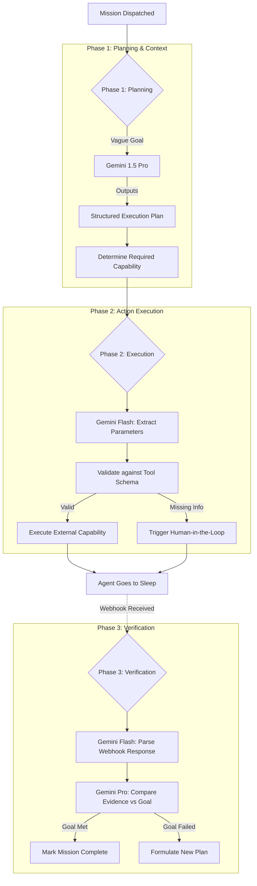

# Agent Runtime & Genkit Flows

ActionOS is powered by an autonomous agent layer built on top of **Google Genkit**. Unlike traditional LLM wrappers that merely generate text, ActionOS uses Genkit to treat the LLM as a deterministic reasoning engine capable of formulating plans, extracting strict schemas, and invoking server-side capabilities.

---

## 1. The Multi-Model Strategy

ActionOS employs a dual-model strategy using Vertex AI to balance speed, cost, and reasoning capability.

* **Gemini 1.5 Pro:** Used strictly for heavy reasoning tasks, such as formulating complex execution plans from vague human instructions or navigating highly ambiguous edge cases.
* **Gemini 3.5 Flash:** Used for rapid, deterministic tasks such as extracting JSON parameters from an email, structuring tool inputs, or evaluating boolean conditions (e.g., "Did the company issue the refund?").

---

## 2. Genkit Workflow Topology

The Agent Runtime does not exist in a single massive prompt. Instead, it is broken down into modular Genkit Flows that are invoked sequentially by the Background Worker.

---

## 3. The Capability Registry

A "Capability" is a secure, isolated tool that the LLM is permitted to invoke. To prevent prompt injection or hallucinated actions, capabilities are rigidly defined and registered in the `CapabilityRegistry`.

### Capability Architecture
1. **Schema Definition:** Every capability defines a strict `zod` schema for its required inputs. Genkit uses this schema to force the LLM to output valid JSON.
2. **Authorization Boundary:** Before the tool executes, the Runtime verifies that the user who created the mission actually has permission to invoke this specific capability.
3. **Idempotency Key:** Every invocation generates a deterministic hash. If a Cloud Task retries unexpectedly, the capability will return the cached result rather than firing twice (e.g., preventing double-sending an email).

### Built-In Capabilities
* `MANAGED_EMAIL`: Sends outbound emails via Resend. The LLM only constructs the subject and body; the runtime handles the actual API keys and SMTP routing.
* `CONTROLLED_SANDBOX`: An internal mock API used for safe testing. The agent can "cancel a subscription" in the sandbox, which returns deterministic JSON evidence for the verification loop.
* `PARTNER_API`: A generic webhook dispatcher for triggering external Zapier or Make.com workflows.

---

## 4. Human-in-the-Loop (Interventions)

ActionOS is designed to "fail safe." If the Genkit flow encounters a scenario it cannot handle safely, it triggers an **Intervention**.

### Intervention Triggers
1. **Ambiguous Goal:** The user asks to "Cancel my account" but there are three different accounts linked. The agent cannot guess.
2. **High-Risk Action:** The agent is about to invoke a capability that involves transferring money or deleting production data.
3. **Schema Failure:** The LLM repeatedly fails to generate JSON that satisfies the capability's `zod` schema.

When an intervention is triggered, the agent writes the question to Firestore, sets the mission state to `NEEDS_ATTENTION`, and **terminates the Cloud Task**. The agent will not consume any more compute or token costs until a human explicitly provides an answer via the Next.js UI, which enqueues a new Cloud Task to resume execution.
