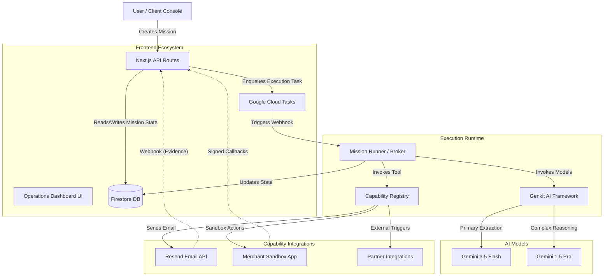
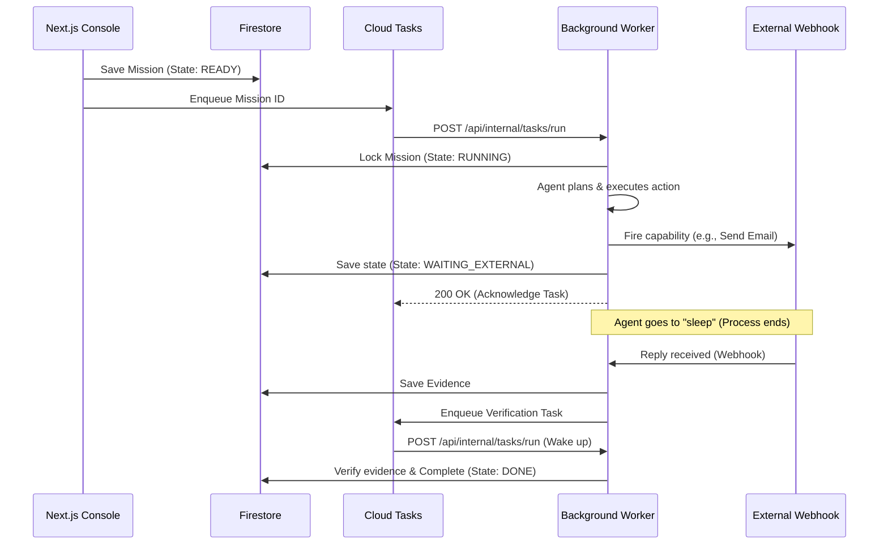
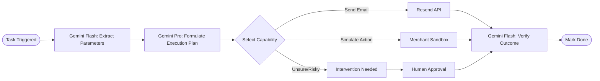
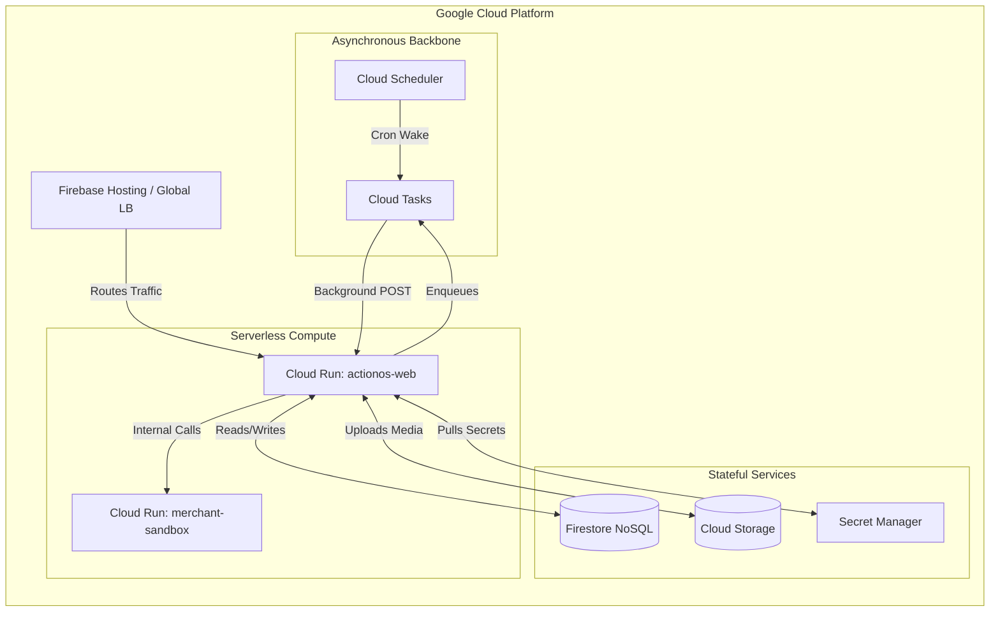

# ActionOS Architecture

ActionOS is a robust, production-ready framework for executing autonomous objectives. It transforms natural language instructions into verifiable tasks, executing them securely and asynchronously over resilient infrastructure. 

This document outlines the system topology, data flow, integration points, and Google Cloud deployment strategy for ActionOS.

---

## 1. Core Paradigm

ActionOS differs from traditional conversational AI because it is **Action-Oriented, Not Chat-Oriented**.
* **Mission:** A user-defined objective representing a high-level goal (e.g., "Cancel the user's subscription and email them a receipt").
* **Agent Framework (Genkit):** ActionOS uses Google's Genkit to orchestrate the intelligence layer, utilizing Gemini 1.5 Pro and Gemini 3.5 Flash models for planning, parameter extraction, and outcome evaluation.
* **Capabilities (Tools):** Discrete, isolated programmatic actions the agent can execute (e.g., hitting a Merchant Sandbox API, sending an email via Resend). Capabilities are strictly bound by authorization and idempotency checks.
* **Execution Runtime (Background Workers):** An asynchronous event loop powered by Google Cloud Tasks that manages the lifecycle, retries, sleeping/waking, and progression of Missions outside of the UI thread.

---

## 2. High-Level Architecture Topology

ActionOS splits responsibilities between a synchronous Web API (for user interactions) and an asynchronous Execution Runtime (for long-running Agent tasks).

---

## 3. System Components Deep Dive

### 3.1. Web API & Console (`@actionos/web`)
The primary interface for users to monitor, manage, and create missions. Built on Next.js 15+ (App Router), it acts as the gateway for both synchronous API interactions and the frontend user experience.
* **Operations Console:** Provides a Live Mission Console showing execution timelines, active capabilities, and system health in a premium Glassmorphism UI.
* **Controllers:** Next.js Route Handlers (`/api/missions/*`) translate HTTP POST requests into domain commands and dispatch them to the Execution Runtime via Cloud Tasks.

### 3.2. Execution Runtime (`@actionos/runtime`)
The heart of ActionOS. When a Mission is created, it is pushed to the Execution Runtime which evaluates its state and determines the next step without blocking the browser.

* **Asynchronous Processing:** Long-running LLM calls and third-party API integrations are processed entirely in the background via Google Cloud Tasks.
* **Idempotency & Resiliency:** Every capability execution and state transition is idempotent. The runtime can recover from transient failures, timeouts, and interrupted actions by simply resuming from the last known state in Firestore.
* **Sleep/Wake Cycle:** The agent can put a mission to "sleep" (e.g., waiting 3 days for a customer to reply) and automatically wake up when an external webhook is received or the timer expires.

### 3.3. Agent & Genkit Flows (`@actionos/genkit-flows`)
Handles all interaction with the Gemini models, treating the LLM as a reasoning engine rather than a text generator.

* **Goal Decomposition:** The agent breaks down the Mission into actionable steps (the Execution Plan).
* **Action Selection:** Determines which capability to invoke based on the current context and available tools.
* **Outcome Verification:** Evaluates the result of a capability invocation (or an external email reply) to verify if the goal was successfully achieved.

### 3.4. Persistence Layer (`@actionos/persistence`)
Built on Google Cloud Firestore, providing a resilient, document-based storage mechanism.
* **State Machine:** Missions transition through a strict, unidirectional lifecycle (`READY → RUNNING → WAITING_EXTERNAL → VERIFYING → DONE`).
* **Event Sourcing (Timeline):** The runtime utilizes an Event Timeline, ensuring every action, plan, and outcome is recorded deterministically in a ledger-like format.
* **Security Budgets:** Rate limiting and execution budgets are enforced at the persistence layer to prevent infinite loops or runaway AI executions.

### 3.5. Capabilities (`@actionos/capabilities`)
Modular, secure wrappers around external integrations.
* **Strict Boundaries:** Capabilities validate inputs before execution and return structured results. They are treated as pure functions whenever possible.
* **Channel Policies:** Determine which channels (e.g., managed email, sandbox, internal API) are available based on the runtime configuration and user authorization.

---

## 4. Google Cloud Infrastructure Alignment

ActionOS is natively designed for Google Cloud's serverless ecosystem to ensure infinite scalability and zero idle-cost maintenance.

* **Google Cloud Run:** Hosts the Web API, Background Workers, and the Merchant Sandbox (controlled demo environment) in autoscaling containers.
* **Google Cloud Tasks:** Powers the background execution scheduling. Cloud Tasks handles the retry backoff algorithms, rate limits, and asynchronous mission progression.
* **Google Cloud Firestore:** The primary NoSQL database used for persistent execution memory, deduplication, and telemetry.
* **Google Cloud Storage:** Stores generated artifacts, media files, and attachments related to missions.
* **Google Secret Manager:** Securely stores runtime secrets such as webhook signing keys, Resend API keys, and Sandbox callback secrets. Environment variables at runtime are pulled securely from here.
* **Google Cloud Scheduler:** Invokes a cron job (`actionos-wake-reconciler`) to periodically sweep the database for delayed wake intents and resumable executions.
* **Firebase Authentication:** Manages user identity, OAuth flows, and secures client-side access to Firestore through strict Security Rules.

---

## 5. Security & Observability

ActionOS implements strict controls over what the AI can and cannot do:

* **End-to-End Correlation:** Every mission execution has a correlation ID that spans from the initial Next.js API request down to the lowest-level Gemini model call and capability execution.
* **Cloud Task Identity:** Webhooks and Cloud Task workers strictly verify the caller using Google OIDC tokens and expected audiences. You cannot trigger a background worker simply by hitting its public URL.
* **Human-in-the-Loop (Interventions):** The agent will proactively pause execution and set its state to `NEEDS_ATTENTION` if it encounters ambiguity or a high-risk capability, securely requesting human approval before proceeding.
