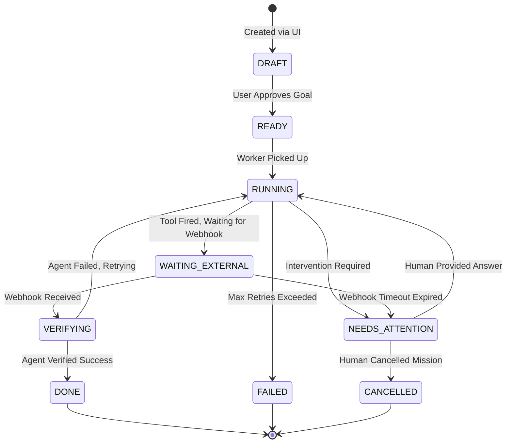

# Data Model & State Machines

ActionOS relies on a robust NoSQL schema within **Google Cloud Firestore**. Because multiple background workers and UI clients can interact with the same mission simultaneously, the data model is designed around **Event Sourcing** and strict **State Machines**.

---

## 1. Core Firestore Collections

The database is divided into three primary collections:

| Collection | Purpose | Mutability |
| :--- | :--- | :--- |
| `missionDrafts` | Temporary storage for the Next.js UI during mission creation. | Highly Mutable |
| `missionRuns` | The core execution state of active and completed missions. | Controlled Mutability (State Machine) |
| `events` | A cryptographically sequenced ledger of every action taken. | **Append-Only / Immutable** |

---

## 2. Mission State Machine

Every document in `missionRuns` adheres to a strict, unidirectional state machine. A mission cannot move backward in the flow unless an intervention resets its phase.



### Critical States
* `WAITING_EXTERNAL`: This is the most crucial state. The Background Worker terminates its process to save compute resources. The mission sits passively in Firestore until an external system (like Resend) pushes data back to the Webhook API, which transitions the state to `VERIFYING` and enqueues a new Cloud Task.
* `NEEDS_ATTENTION`: The mission is halted. Only a manual update from an authorized human via the Next.js UI can unblock it.

---

## 3. Event Ledger (Event Sourcing)

Instead of just updating the `state` field on a mission, ActionOS utilizes **Event Sourcing**. Every time a mission progresses, an immutable document is appended to the `events` subcollection.

### The `RuntimeTimelineEvent` Schema
```typescript
interface RuntimeTimelineEvent {
  eventId: string;             // UUID
  missionId: string;           // Parent Mission
  sequence: number;            // 1, 2, 3, etc.
  type: "PLAN_APPROVED" | "ACTION_RESULT" | "EVIDENCE_RESULT" | "MISSION_CONTROL";
  actor: "PERSON" | "SYSTEM" | "COUNTERPARTY";
  state: string;               // e.g., "WAITING_EXTERNAL"
  occurredAt: string;          // ISO-8601 Timestamp
  reasonCodes: string[];       // Human-readable explanations
  idempotencyKey?: string;     // Deduplication hash
}
```

### Why Event Sourcing?
1. **Auditability:** You can reconstruct exactly what the Agent was thinking, what tool it used, and what evidence it received at any exact millisecond.
2. **Idempotency:** Before a worker executes an action, it checks the event ledger for a matching `idempotencyKey`. If it exists, the worker safely aborts the duplicate task.
3. **Optimistic Concurrency:** When appending an event, Firestore checks if the `sequence` number matches expected state, preventing race conditions if two webhooks hit the system simultaneously.

---

## 4. Concurrency & Locking

To prevent two Cloud Tasks from processing the same mission simultaneously (e.g., if a webhook arrives at the exact moment a timeout triggers), ActionOS uses Firestore Transactions to implement soft-locking.

When a worker picks up a task, it writes:
```json
{
  "lockedAt": "2024-03-15T12:00:00Z",
  "lockedBy": "worker-uuid-1234"
}
```
If another worker attempts to pick up the mission, the transaction fails and the secondary task safely aborts. The lock automatically expires after 5 minutes if the primary worker crashes.
